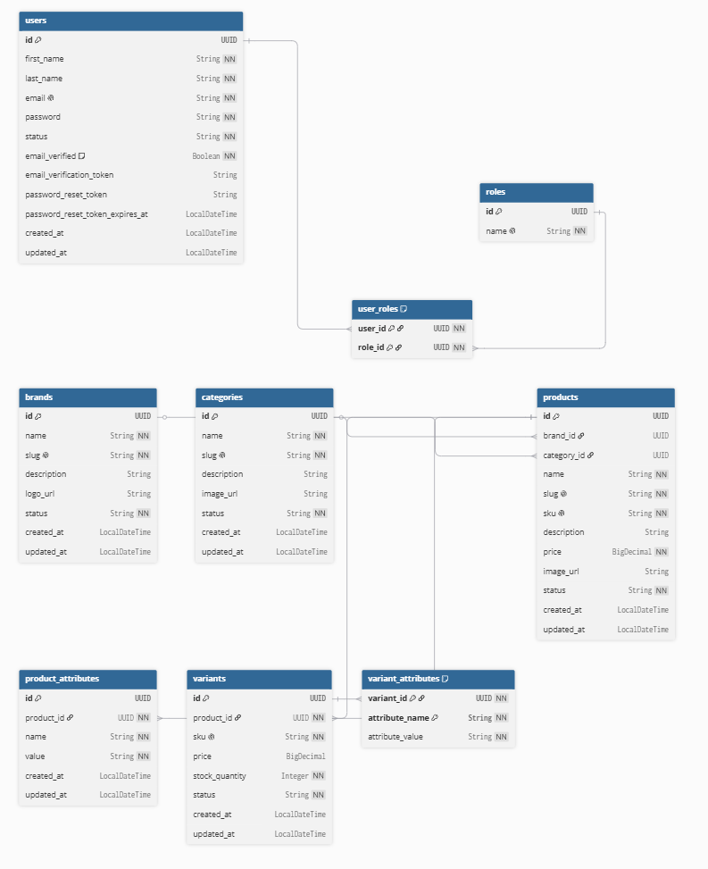

# Product Catalog Service

A REST API service for managing and retrieving a product catalog, built with Spring Boot.

---

## Tech Stack

- Java 17, Spring Boot 4.0.6
- PostgreSQL (AWS RDS)
- Spring Security 7 + JWT
- Lombok, Jakarta Validation

---

## Setup

### Run locally (dev profile — port 8081)
```bash
mvn spring-boot:run -Dspring-boot.run.profiles=dev
```

### Build JAR
```bash
mvn clean package -DskipTests
java -jar target/catalog-0.0.1-SNAPSHOT.jar
```

### Default credentials (seeded on startup)
- **Email:** `admin@catalog.com`
- **Password:** `admin123`

---

## API Routes

### Auth

| Method | Route | Auth |
|---|---|---|
| POST | `/api/v1/auth/register` | Public |
| POST | `/api/v1/auth/login` | Public |
| GET | `/api/v1/auth/me` | JWT |
| POST | `/api/v1/auth/change-password` | JWT |

### Brands

| Method | Route | Auth |
|---|---|---|
| GET | `/api/v1/brands` | Public |
| GET | `/api/v1/brands/{slug}` | Public |
| POST | `/api/v1/admin/brands` | ADMIN |
| PUT | `/api/v1/admin/brands/{id}` | ADMIN |
| DELETE | `/api/v1/admin/brands/{id}` | ADMIN |

### Categories

| Method | Route | Auth |
|---|---|---|
| GET | `/api/v1/categories` | Public |
| GET | `/api/v1/categories/{slug}` | Public |
| POST | `/api/v1/admin/categories` | ADMIN |
| PUT | `/api/v1/admin/categories/{id}` | ADMIN |
| DELETE | `/api/v1/admin/categories/{id}` | ADMIN |

### Products

| Method | Route | Auth |
|---|---|---|
| GET | `/api/v1/products` | Public |
| GET | `/api/v1/products/{slug}` | Public |
| POST | `/api/v1/admin/products` | ADMIN |
| PUT | `/api/v1/admin/products/{id}` | ADMIN |
| DELETE | `/api/v1/admin/products/{id}` | ADMIN |

### Variants

| Method | Route | Auth |
|---|---|---|
| GET | `/api/v1/products/{productId}/variants` | Public |
| POST | `/api/v1/admin/products/{productId}/variants` | ADMIN |
| PUT | `/api/v1/admin/products/{productId}/variants/{variantId}` | ADMIN |
| DELETE | `/api/v1/admin/products/{productId}/variants/{variantId}` | ADMIN |

### Attributes

| Method | Route | Auth |
|---|---|---|
| GET | `/api/v1/products/{productId}/attributes` | Public |
| POST | `/api/v1/admin/products/{productId}/attributes` | ADMIN |
| PUT | `/api/v1/admin/products/{productId}/attributes/{attributeId}` | ADMIN |
| DELETE | `/api/v1/admin/products/{productId}/attributes/{attributeId}` | ADMIN |

### Images

| Method | Route | Auth |
|---|---|---|
| GET | `/api/v1/images/{subfolder}/{filename}` | Public |
| POST | `/api/v1/admin/images/upload` | ADMIN |
| DELETE | `/api/v1/admin/images?path=...` | ADMIN |

---

## Task Management

Development tasks were tracked in [`todo.md`](todo.md).

---

## ERD

